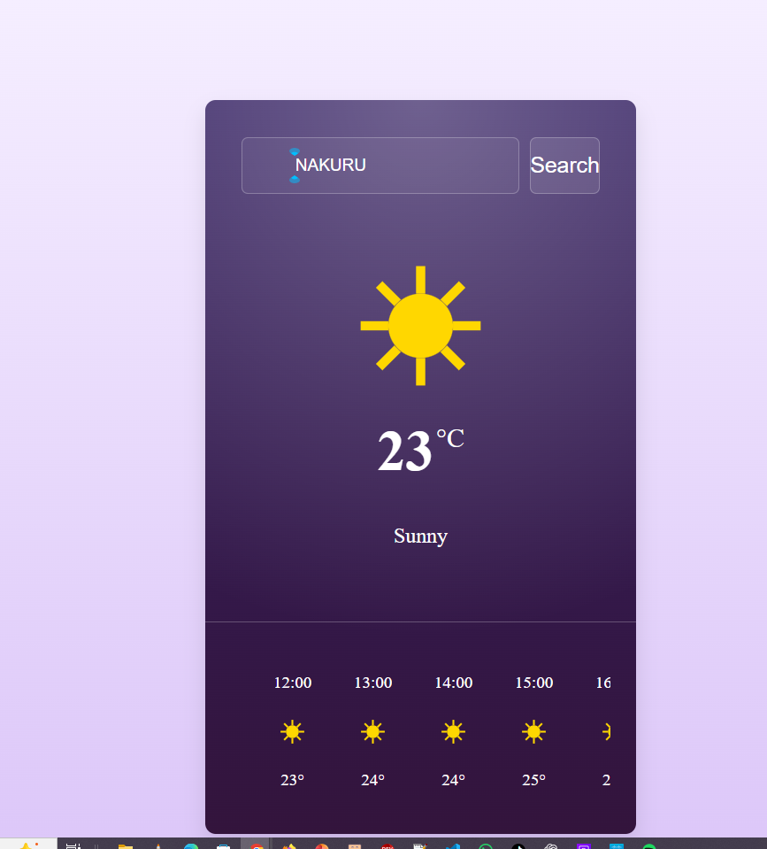
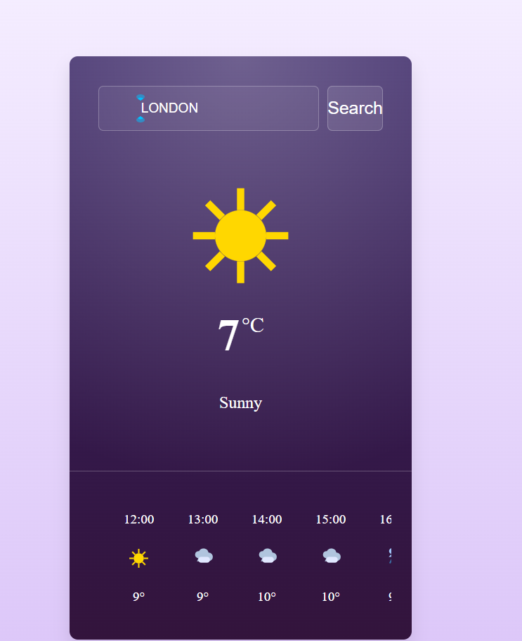

# Weather App

A modern, responsive weather application built with React, TypeScript, and Vite. Get real-time weather information for any city, including current conditions and hourly forecasts.

## Features

- 🌤️ Real-time weather data from WeatherAPI
- 📱 Fully responsive design for all devices
- 🌙 Smart icon switching (sunny/cloudy based on day/night)
- 🔍 City search with geolocation support
- 📊 Hourly weather forecast
- ⚡ Built with TypeScript for type safety
- 🎨 Beautiful gradient UI with weather-themed icons

## Screenshots




## Tech Stack

- **Frontend**: React 19, TypeScript
- **Build Tool**: Vite
- **Styling**: CSS with responsive design
- **API**: WeatherAPI.com

## Getting Started

### Prerequisites

- Node.js (v16 or higher)
- npm or yarn

### Installation

1. Clone the repository:
   ```bash
   git clone https://github.com/waithira-felix-coder/react-weather-app.git
   cd react-weather-app
   ```

2. Install dependencies:
   ```bash
   npm install
   ```

3. Get a free API key from [WeatherAPI.com](https://www.weatherapi.com/)

4. Create a `.env` file in the root directory:
   ```
   VITE_API_KEY=your_api_key_here
   ```

5. Start the development server:
   ```bash
   npm run dev
   ```

6. Open [http://localhost:5173](http://localhost:5173) in your browser

### Build for Production

```bash
npm run build
```

## Usage

- Enter a city name in the search bar and press Enter
- Click the location button to get weather for your current position
- View current weather conditions and 24-hour forecast

## Project Structure

```
src/
├── components/
│   ├── Currentweather.tsx    # Current weather display
│   ├── Hourlyweather.tsx     # Hourly forecast items
│   ├── SearchSection.tsx     # Search and location inputs
│   └── NoResults.tsx         # Error/no results display
├── constants.ts              # Weather condition mappings
├── App.tsx                   # Main app component
├── main.tsx                  # App entry point
└── index.css                 # Global styles
```

## API Key Setup

This app uses WeatherAPI.com for weather data. Get your free API key and add it to the `.env` file as shown above. The key is kept secure and not committed to version control.

## Contributing

1. Fork the repository
2. Create a feature branch
3. Make your changes
4. Test thoroughly
5. Submit a pull request

## License

This project is open source and available under the [MIT License](LICENSE).

---

Built with ❤️ using React and TypeScript
import reactX from 'eslint-plugin-react-x'
import reactDom from 'eslint-plugin-react-dom'

export default defineConfig([
  globalIgnores(['dist']),
  {
    files: ['**/*.{ts,tsx}'],
    extends: [
      // Other configs...
      // Enable lint rules for React
      reactX.configs['recommended-typescript'],
      // Enable lint rules for React DOM
      reactDom.configs.recommended,
    ],
    languageOptions: {
      parserOptions: {
        project: ['./tsconfig.node.json', './tsconfig.app.json'],
        tsconfigRootDir: import.meta.dirname,
      },
      // other options...
    },
  },
])
```
=======
# react-weather-app
>>>>>>> 0b0162114b5b4c5f7e57b2a784d6dc657422327c
